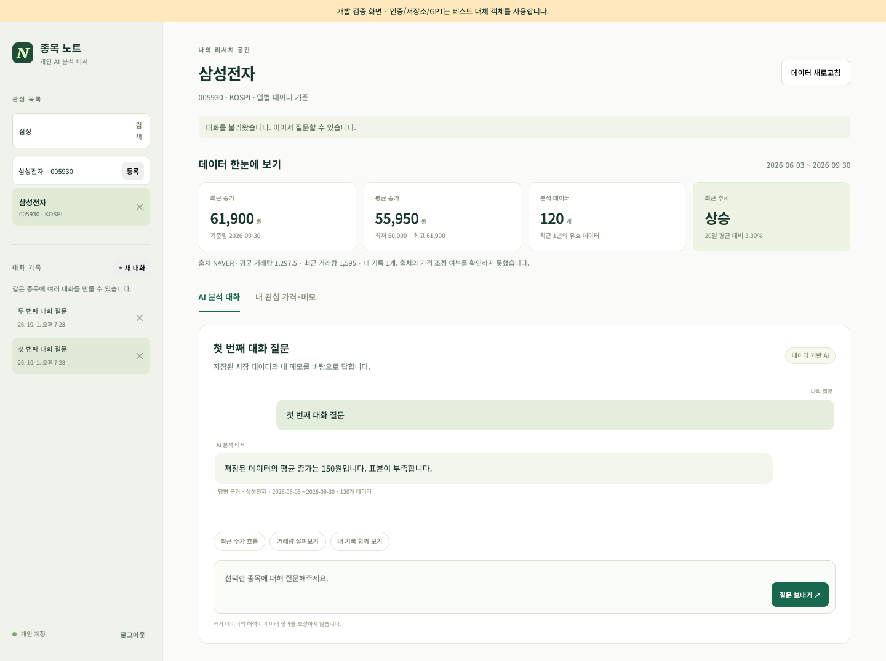
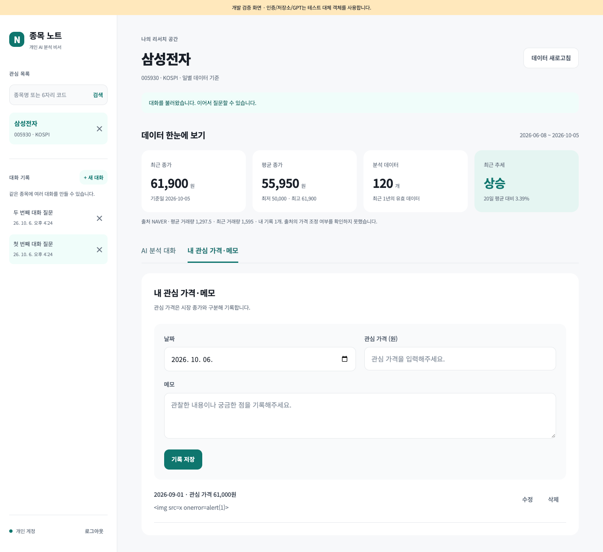

# 종목 노트 · 개인용 국내 주식 AI 분석 비서

국내 관심 종목의 과거 주가·거래량과 내가 남긴 관심 가격·메모를 함께 이해하는 개인용 웹 서비스입니다. 여러 종목을 등록하고 한 종목씩 분석하며, 같은 종목에 여러 대화를 만들 수 있습니다.

현재 상태: 로컬 기능 구현·개발 검증 완료, 실제 Firebase/GPT 연결 및 Render/Vercel 배포 검증 대기. 개발 화면의 인증·저장소·AI는 테스트 대체 객체를 사용합니다.

## 기능과 기술

- 국내 종목 검색, 관심 목록 등록·제거, 최근 1년 일별 데이터 수집·저장
- 시장 데이터 통계와 최근 추세, 거래량 및 개인 기록 요약
- 날짜·관심 가격·메모 추가·조회·수정·삭제
- 컨텍스트를 반영한 AI 답변·로딩 표시·자동 저장
- 종목별 복수 대화 생성·목록·전체 메시지 복원·이어가기·삭제
- Firebase 로그인 및 본인 UID 한 개만 허용하는 서버 인증

| 구성 | 기술 |
| --- | --- |
| 백엔드 | Python 3.10+, FastAPI, Pydantic, uvicorn |
| 프론트 | HTML/CSS/JavaScript ES modules, UI 프레임워크 없음 |
| 저장·인증 | Firebase Firestore, Firebase Authentication, firebase-admin |
| AI | OpenAI Python SDK, Responses API |
| 시장 데이터 | KRX KIND 상장회사 목록, NAVER 일별 데이터 |
| 배포 | Render API, Vercel 정적 프론트 |

라우터는 요청·인증, 서비스는 분석과 업무 흐름, 저장소는 Firestore, provider는 외부 연결을 담당합니다. 입력은 Pydantic으로 검증합니다. 요약 계산은 외부 서비스와 분리하며 관심 가격을 실제 시장 가격에 섞지 않습니다.

## 배포 URL

| 서비스 | 상태 |
| --- | --- |
| Vercel 프론트 | 계정·환경 설정 및 실제 배포 대기 |
| Render API | 계정·환경 설정 및 실제 배포 대기 |
| Swagger | 실제 Render 주소의 /docs — 배포 대기 |

실제 배포·접근 확인 후 주소를 기록합니다. [설정·배포 안내](docs/deployment.md)를 따라 계정과 키를 준비합니다.

## 로컬 실행

Python 3.10 이상(검증 버전 3.12.14), Node.js 22 이상을 사용합니다.

```sh
python3 -m venv backend/.venv
backend/.venv/bin/python -m pip install -r backend/requirements-lock.txt
cp backend/.env.example backend/.env
cp frontend/.env.example frontend/.env
```

두 환경 파일을 아래 표와 설정 안내에 맞춰 채운 뒤 API를 실행합니다.

```sh
backend/.venv/bin/python -m uvicorn app.main:app --app-dir backend --reload --port 8000
```

별도 터미널에서 프론트를 실행합니다.

```sh
node frontend/scripts/build-site.mjs
backend/.venv/bin/python -m http.server 5500 --directory frontend/dist --bind 127.0.0.1
```

프론트: http://127.0.0.1:5500, Swagger: http://127.0.0.1:8000/docs. 종료는 각 터미널에서 Ctrl+C입니다. 프론트 환경 변수를 바꾸면 빌드를 다시 실행합니다. 비밀 설정 없이 health/docs를 확인할 수 있지만 로그인·개인 데이터·GPT 기능은 실제 설정이 필요합니다.

## 환경 변수

| 위치 | 변수 | 설명 |
| --- | --- | --- |
| 서버 | OPENAI_API_KEY | 선택한 OpenAI 호환 플랫폼의 비밀 키 |
| 서버 | OPENAI_MODEL | 선택한 플랫폼에서 지원하는 모델 ID |
| 서버 | OPENAI_BASE_URL | API 기본 주소(`/v1` 포함), 기본 `https://api.openai.com/v1` |
| 서버 | OPENAI_API_MODE | `responses` 또는 `chat_completions` |
| 서버 | OPENAI_CHAT_TOKEN_FIELD | Chat 출력 상한 필드: `max_completion_tokens` 또는 `max_tokens` |
| 서버 | OPENAI_MAX_OUTPUT_TOKENS | 출력 상한, 기본 800 |
| 서버 | OPENAI_TIMEOUT_SECONDS | 호출 timeout, 기본 45초 |
| 서버 | CHAT_LOCK_SECONDS | 대화 처리 잠금, 기본 90초 |
| 서버 | CHAT_INPUT_MAX_CHARS | 입력 문자 상한, 기본 24,000 |
| 서버 | FIREBASE_SERVICE_ACCOUNT_JSON | 서비스 계정 JSON, 배포 환경 |
| 서버 | GOOGLE_APPLICATION_CREDENTIALS | JSON 대신 사용할 키 파일 절대 경로 |
| 서버 | ALLOWED_USER_UID | 허용할 개인 Firebase 사용자 |
| 서버 | ALLOWED_ORIGINS | 허용 origin의 JSON 배열 |
| 서버 | PORT | Render 제공 포트 |
| 프론트 | API_BASE_URL | 백엔드 주소 |
| 프론트 | FIREBASE_API_KEY | Firebase 웹 공개 설정 |
| 프론트 | FIREBASE_AUTH_DOMAIN | 웹 인증 도메인 |
| 프론트 | FIREBASE_PROJECT_ID | 프로젝트 ID |

OpenAI/서비스 계정 키는 서버에만 둡니다. 프론트 빌드는 공개 설정 4개와 웹 자산만 출력합니다. 환경 파일·키 파일·생성 설정·개인 데이터는 Git에서 제외합니다. 웹 Firebase 설정은 인증을 대신하지 않으며 API가 token과 UID를 검증합니다.

## API와 저장 구조

/api/*는 Firebase Bearer token과 허용 UID를 요구합니다. /health와 /docs는 공개입니다.

| 메서드 | 경로 | 기능 |
| --- | --- | --- |
| GET | /api/stocks | 종목명·코드 검색 |
| GET, POST | /api/watchlist | 관심 목록 조회·등록 |
| DELETE | /api/watchlist/{id} | 관심 목록 제거 |
| POST | /api/stocks/{symbol}/refresh | 시장 데이터 갱신 |
| GET, POST | /api/data | 개인 기록 조회·추가 |
| PUT, DELETE | /api/data/{id} | 개인 기록 수정·삭제 |
| GET | /api/data/summary | 시장·개인 데이터 요약 |
| GET, POST | /api/conversations | 종목별 대화 목록·새 대화 저장 |
| GET, DELETE | /api/conversations/{id} | 전체 메시지 복원·삭제 |
| POST | /api/chat | AI 답변 및 자동 저장 |

검색·기록·대화 목록은 items/next_cursor를 반환합니다. 관심 목록은 개인 목록 전체를 반환합니다. 대화 목록에는 messages가 없고 상세 API가 전체 messages를 반환합니다. chat 입력은 symbol, message, request_id(UUID), 선택적인 conversation_id입니다.

Firestore 컬렉션은 stocks/watchlist/market_data/data/conversations/sync_state와 내부 중복 방지용 chat_requests입니다. messages는 conversations/{id}/messages에 저장합니다. 개인 문서에는 owner_uid를 저장하고 API가 소유권을 검증합니다. 브라우저 직접 Firestore 접근은 rules로 차단합니다.

## 컨텍스트 주입과 제한

```text
질문 → 종목·소유권 확인 → 저장 데이터 요약
→ 시스템 지침에 시장 요약 + 개인 기록·최근 대화 전달
→ GPT 응답 → 질문·답변·당시 요약을 함께 저장 → 화면 표시
```

채팅과 summary API는 같은 서비스를 사용합니다. 시장 요약은 시스템 지침에, 개인 메모는 참조 데이터로 전달합니다. 최근 대화 12개, 개인 기록 20개와 입력·출력 상한을 적용합니다. Responses API는 store=False로 호출하며 기록은 본인 Firestore에 저장합니다. 이 옵션이 모든 제공자 데이터 보존을 없앤다는 의미는 아닙니다.

최근 20거래일과 직전 20거래일 평균 종가를 비교해 변화율 +1% 초과는 상승, -1% 미만은 하락, 그 사이는 유지입니다. 40건 미만이면 판단 불가, 100건 미만이면 표본 부족을 표시합니다. 일별 과거 데이터이며 가격 조정 여부는 확인되지 않은 상태로 표시합니다. 수집 실패 시 기존 저장 데이터와 갱신 실패 안내를 표시합니다.

OpenAI 호출은 과금될 수 있습니다. 출력 상한, timeout, SDK 자동 재시도 0회와 요청 ID로 반복 비용을 줄입니다. 성공한 요청의 재시도는 저장 결과를 반환합니다. 모델 호출과 DB 저장 사이 모든 장애에서 완전한 1회 실행을 보장하지는 않습니다. 저장 결과 불명확 시 자동 재호출하지 않고 기록을 다시 확인하도록 안내합니다.

## 검증과 개발 화면

```sh
backend/.venv/bin/python -m pytest backend/tests -q
node --test frontend/tests/*.test.mjs
backend/.venv/bin/python backend/scripts/verify_market.py --symbol 005930
```

실제 연결 검증은 [설정 안내](docs/deployment.md)를 따릅니다. 브라우저 검증은 테스트 전용 preview_server와 browser.mjs를 사용합니다. Playwright 및 Chrome이 필요하고 PLAYWRIGHT_MODULE로 설치 경로를 지정할 수 있습니다. [검증 기록](docs/verification.md)은 대체 연결·실제 시장 조회·실제 외부 서비스·배포 확인을 구분합니다.

아래 개발 화면은 인증·저장소·GPT를 테스트 연결로 검증한 것으로 최종 제출용 실제 서비스 증빙을 대신하지 않습니다.




최종 제출용 요약+질문/답변, CRUD 동작, 대화 복원 스크린샷은 실제 연결·배포 후 추가합니다. 다른 시장과 선택 보너스 기능은 첫 버전 범위에서 제외합니다.

- [설계](docs/superpowers/specs/2026-10-01-stock-assistant-design.md)
- [구현 계획](docs/superpowers/plans/2026-10-01-stock-assistant.md)
- [실제 연결·배포 안내](docs/deployment.md)
- [공식 OpenAI Responses 문서](https://developers.openai.com/api/docs/guides/migrate-to-responses)
